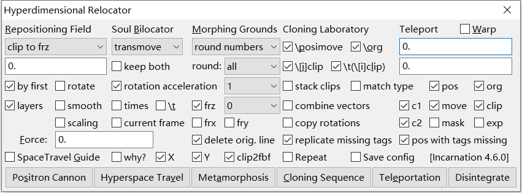
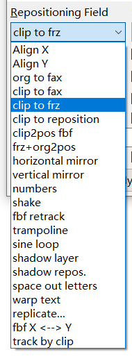
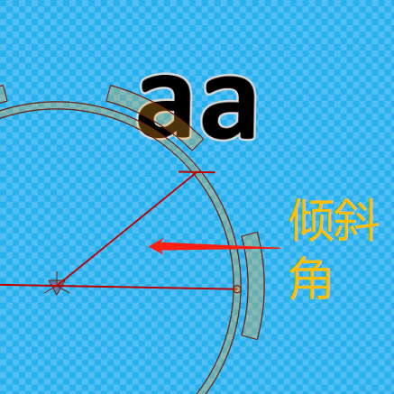
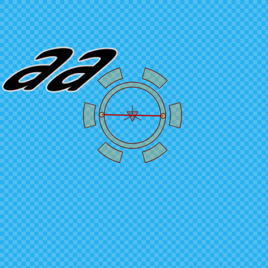
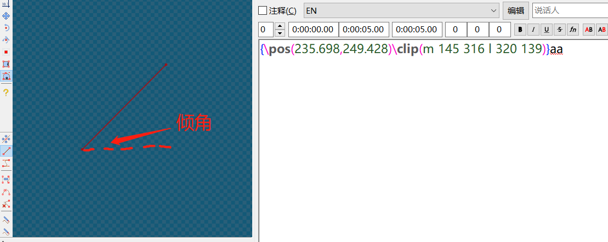
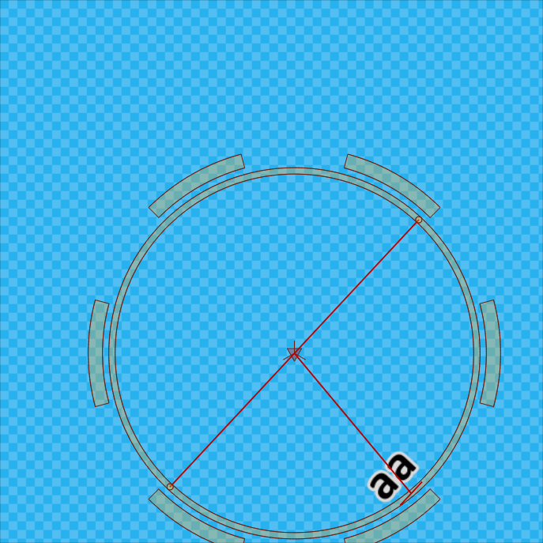
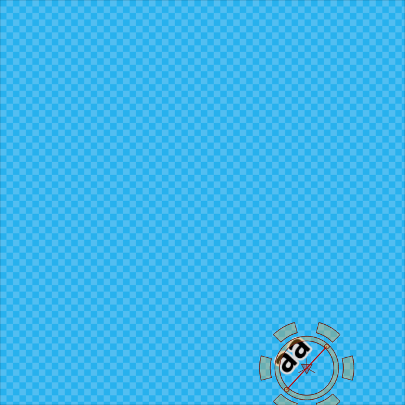
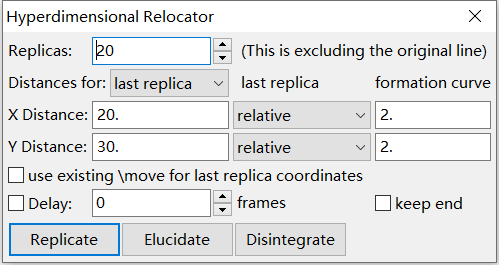
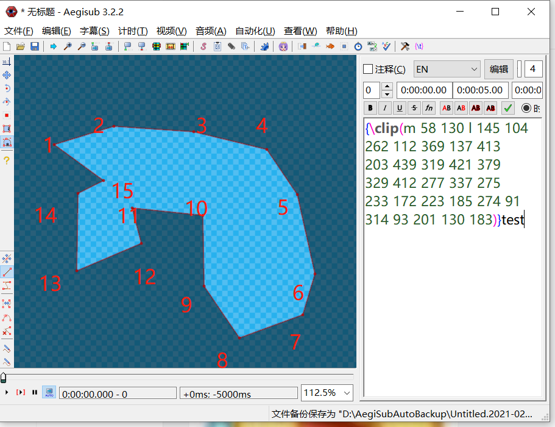
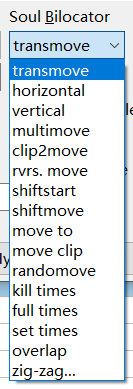

# Hyperdimensional Relocator Tutorial (Simplified Chinese)

此篇教程将会对 Aegisub 插件 Hyperdimensional Relocator 的官方英文介绍进行翻译，并额外对各项操作进行解释。

> 教程测试环境： Aegisub 3.2.2
>
> 插件版本： 4.6
>
> 译者：ihkk

# 官方文档对照翻译

## 介绍

| 原文                                                         | 译文                                                         |
| :----------------------------------------------------------- | :----------------------------------------------------------- |
| Introduction  Hyperdimensional Relocator offers a plethora of functions,focusing primarily on \pos, \move, \org, \clip, and rotations. Anything related to positioning, movement, changing shape, etc.,Relocator aims to make it happen. Position Cannon deals mostly with \pos, Hyperspace Travel with \move, Cloning Sequence copies from line to line, Teleportation changes coordinates, and Metamorphosis changes various things. Current version: 4.6.0  Update location: http://unanimated.hostfree.pw/ts/relocator.lua | 介绍  Hyperdimensional Relocator 提供诸多功能，主要聚焦 `\pos, \move, \org, \clip 和旋转`（译者注：`\frz`） 此插件旨在于实现各种位置、移动、变形等相关变化。  Position Cannon （将译作`定位区`）主要处理 `\pos` 有关的变化，Hyperspace Travel （将译作`位移区`）主要处理 `\move` 有关的变化，Cloning Sequence （将译作`克隆区`）可以克隆多条字幕，Teleportation （将译作`坐标移动区`）可以更改坐标，Metamorphosis (将译作`变形区`)可以处理很多东西（译者注：？？？）。  当前版本：4.6.0  更新地址：http://unanimated.hostfree.pw/ts/relocator.lua |

## Position Cannon 定位区

| 原文                                                         | 译文                                                         |
| ------------------------------------------------------------ | ------------------------------------------------------------ |
| `Align X` means all selected \pos tags will have the same given X coordinate. Same with `Align Y` for Y.    Useful for aligning multiple signs horizontally/vertically or mocha signs that should move horizontally/vertically.    'by first' aligns by X or Y from the first line.   | `Align X`，可以将所有的被选中的`\pos`标签的X轴坐标统一。`Align Y`同理，用于统一Y轴坐标。 *此选项对于使多个标签水平竖直很有用，也可以在Mocha追踪时使用。对于一些Mocha追踪的结果，可以将原本应该是水平/竖直移动但跟踪错误的追踪轨迹校准。*   |
| `Horizontal Mirror`: Duplicates the line and places it horizontally across the screen, mirrored around the middle.    If you input a number, it will mirror around that coordinate instead,    so if you have \pos(300,200) and input is 400, the mirrored result will be \pos(500,200).    'keep both' will keep the original line along with the mirrored one. 'rotate' will flip the text accordingly. Vertical Mirror is the logical vertical counterpart.    | `Horizontal Mirror`，可以将选中的字幕的位置关于屏幕中心轴对称（默认不保留初始字幕）。如果你在下方的输入框中填入了数字，那么就会以输入的直线X=?作为对称轴。 例如要变换的坐标是`\pos(300,200)`而输入的对称轴是`400`，那么镜像得到的便是`\pos(500,200)`。  下方有两个选项，`keep both`和`rotate`。如果勾选了`keep both`，那么对称变换会保留初始的字幕。如果勾选了`rotate`，那么便会旋转相应的度数，此处为180°。 |
| `Shake`: Apply to fbf lines with \pos tags to create a shaking effect.    Input radius for how many pixels the sign may deflect from the original position.    (Use Teleport coordinates if you want different values for X and Y.)    'scaling' randomises fscx/y. Value '6 'with fscx150 -> 144-156. (Uses input from the Force field.)    'rotate' adds shaking to \frz (pos input, degrees). 'smooth' will make shaking smoother.    'layers' will keep position/rotations the same for all layers. (Same value for same start time.)   | `Shake`抖动效果：需要应用于有`\pos`标签的`fbf（frame-by-frame，被逐帧拆开的字幕）`多条字幕。 在框中输入想要每次随机偏移的x&y范围（译者注：例如，原先的坐标为`\pos(100,100)`，填入的范围为`10`，那么随机生成的位置将使`\pos(100±10,100±10)`。 （特别的，你可以在`Teleport坐标移动区`（右上角）分别填入想要偏移的x和y的范围。）  勾选`scaling`，并在下方的`Force`输入框中，键入变形的范围，可以在抖动的同时，加入变形效果。例如键入了`6`，而原先的变形是`\fscx150`，那么就会随机变形为`\fscx144-\fscx156`。  勾选`rotate`，可以在抖动时应用随机的旋转效果。旋转的角度为`\frz±填入的xy位移范围`。 （默认）勾选`layers`，会使所有选中的字幕进行统一的随机移动。（相同开始时间有相同的抖动）（译者注：此选项仅在同时多句字幕时有效） |
| `Trampoline / Sine Loop`: Creates fbf movement between point A and point B. Check online manual for details.   | `Trampoline / Sine Loop`：生成两点间的`fbf逐帧字幕`。更多参考网上手册。 译者注：`Trampoline`为抛物线，`Sine`为正弦曲线。这两个功能都可以实现一句字幕在两点之间来回运动的效果。使用时，应在`Teleport坐标移动区`（右上角）分别填入运动终点的x和y的偏移量。 |
| `Shadow Layer`: Creates shadow as a new layer. For offset, it uses in this order of priority:    1. value from Positron or Teleport (xshad, yshad). 2. shadow value from the line. 3. shadow from style.   | `Shadow Layer`：创建一个新的纯阴影字幕，将原字幕和其阴影分离开来。 对于阴影的偏离值，遵从以下优先级： 1. 左上角的`disPosition`输入框填入的数值，或右上角的`Teleport`输入框填入的`xshad`和`yshad`数值。 2. 字幕中标签的数值。 3.字幕样式中的阴影数值。 |
| `Shadow Reposition`: "centers" text with shadow by the \shad distance. With \shad4, moves 2 pixels left & up.    Works with \[xy]shad. Useful when top layer has shadow & needs centering within bottom layer with border.   | `Shadow Reposition`：重新定位阴影位置。根据阴影距离，”居中“字幕。例如阴影长度为`\shad4`，那么会向左上方移动`2`个像素。 适用于`\[xy]shad`。在需要对齐多个图层时可能有用。（译者注：不太懂） |
| `fbf X <--> Y`: The fbf increase/decrease in pos X will become that of pos Y and vice versa.    If 'by first' is checked, the first line is the reference line (won't change). Otherwise, it's the last line.    With 'rotate' checked, the resulting direction is reversed. (Recalculator's Mirror adds more options to this.)    Example: If a sign moves 100 pixels to the right, with 'first' it will move 100px down (or up with 'rotate').    Without 'first', the directions are the same, but sign will end where it did before, not start.   | `fbf X <--> Y`：将`fbf逐帧字幕`中`\pos`位置代码里的`X轴`变化量和`Y轴`变化量互换。 如果勾选`by first`，那么就以第一句作为基准，不会改变；如果不勾选，就以最后一句作为基准不改变。 如果`rotate`变勾选，那么运动方向将会相反。（译者注：例如原先运动方向是`→`，勾选了`rotate`则会变为`↑`，不勾选则是`↓`。）  例如：如果原先是向右移动100像素，勾选了`by first`就会向下移动100像素（如果勾选`rotate`则会向上移动），如果没勾选`by first`，运动方向依然是向下，但原先的运动起点将会是新的运动的终点。） |
| `Numbers:` Informative only function that shows \pos differences between consecutive selected lines.    Can be useful if you want to continue a fbf movement and need an idea of the distances required. | `Numbers`：对于选中的连续字幕，可以显示`\pos`的变换量。 在你需要补充`连续移动的fbf逐帧字幕`时，可以列表显示一次需要移动多少量。  |
| `org to fax`：Calculates \fax from the line between \pos and \org coordinates. | `org to fax`：在绕Z轴旋转的可视化操作界面，通过改变字幕和中心的位置，来调整倾斜度`\fax` |
| `clip to fax`：Calculates \fax from the line between the first 2 points of a vectorial clip.    Both of these work with \fscx, \fscy, and \frz.    If the clip has 4 points, points 3-4 are used to calculate fax for the last character, and a gradient is applied.    See blog post for more info - http://unanimated.hostfree.pw/itw/tsblok.htm#fax | `clip to fax`：与`org to fax`类似，只是倾斜角为`\clip`中两点连线的倾角。如果`\clip`有四个点，那么第3-4个将会被作为参考点。 |
| `Clip to Frz`: Calculates \frz from the first 2 points of a vectorial clip. Direction of text is from point 1 to point 2.    If the clip has 4 points, the frz is average from 1-2 and 3-4. (Both lines must be in the same direction.)    This helps when the sign is in the middle of a rectangular area where the top and bottom lines converge. | `clip to frz`：与`clip to fax`类似，`\clip`直线倾斜角为旋转的度数。如果`\clip`有四个点，那么`\frz`会选取1-2和3-4的平均值。（二者需要平行） |
| `clip to reposition`：Shifts \pos based on first 2 points of a vectorial clip.    You can use a reference point in the video image and set the clip points at start/end of the movement. | `clip to reposition`：根据`\clip`中两点的**相对位置**，移动字幕。你可以结合视频中的参考点来使用。 |
| `clip2pos fbf`：This is for manual fbf tracking. Track something in the video with one point of a clip in each frame.    The first line is a reference point. The \pos of other lines will shift based on the difference between the clip on the first line and the clip on the current line. (Starting point is always \pos from line 1.) | `clip2pos fbf`：适用于手动追踪，在每一帧中用一个点追踪。第一行是一个参考点，其他行的`\pos`将会在第一行的基础上进行移动。 |
| `frz+org2pos`：把有`\org`的旋转变为无`\org`的旋转，显示效果不变。 |  |
| `space out letters`：把一句字幕的所有字符拆开，分散在`\clip`的选取中。 |  |
| `warp text`：使字幕向上/向下拱起。需要配合`space out letters`使用，先分离文字，然后在左上角框中输入拱起的值，正为上负为下。 |  |
| `replicate`：重复字幕，并且可以设置单词重复的位移量。  如右图：`replicas`：重复次数 `[XY] Distance`单次偏移量 |  |
| `Track by clip`：根据`\clip`的轨迹移动追踪。会根据`\clip`的点的位置，生成`fbf逐帧字幕`的`\pos`的位置 |  |
| `fbf retrack`：There is simple mode and 'smoothen track' mode.  Simple mode is like fbf-transform for position, but it can be applied to several layers at the same time and have different accel for X and Y. If you check 'layers', the scale is not by selection but by start time. You can have subtitles sorted by layers, but each layer must be sorted by time. Of course each frame will have the same position for all layers/signs. You can use Repositioning Field for accel, or Teleport for separate X/Y accel. You can track only X or Y if you check only one of those. Without 'layers' checked, it simply goes through selected lines and can be applied to signs in the same frame.  'Smoothen track' mode is activated when you check 'smooth'. This is designed for smoothening tracking data, i.e. it will move positions that stand out closer to the main line of the track. It would make no sense to apply this to shaking signs, but if you have trouble tracking something in mocha and the sign tends to jump off on some frames, this will pull the jumps back in line. You can apply different strength of smoothening, by using the Force Field. 0 is the lowest strength; 100 is the highest and will make the track a straight line. | `fbf retrack`：拥有`简单模式`和`平滑模式`。  `简单模式`比较像`位置\pos`的`fbf逐帧转换`，但可以同时应用于不同行的字幕，同时可以分别设置`x`和`y`的加速度。（译者注：使用条件：已经有多条时间不同但位置相同的`fbf`字幕，且第一句、最后一句的位置不同。）可以勾选`layers`来区分不同的段。如果开始时间一致，那么相同帧的不同字幕将会有相同的位置。 你可以在左上角的`disPosition`输入框填入加速度，或右上角的`Teleport`输入框填入独立的`x`和`y`的加速度。  `平滑追踪`模式将在你勾选了`smooth`时被激活。这是用来平滑数据的，也就是说，它会将移动更靠近主字幕。你不应该对`抖动`的字幕应用这个选项，但是可以用在`mocha追踪`时，例如，某一个帧追踪的位置突然偏离了正确的轨迹，那么这个模式可以把脱离的字幕拉回到应在的位置。 你可以使用不同的平滑力度，在`Force Field`中填入数值。0是最低力度，100是最高数值，会让轨迹变成一条直线。 （译者注：可以理解为`拟合`） |

## Hyperspace Travel 位移区

| 原文                                                         | 译文                                                         |
| ------------------------------------------------------------ | ------------------------------------------------------------ |
| `Transmove` Main function: create \move from two lines with \pos. Duplicate your line, and position the second one where you want the \move the end. Script will create \move from the two positions. Second line will be deleted by default; it's there just so you can comfortably set the final position.  Extra function: to make this a lot more awesome, this can create transforms. The second line is used not only for \move coordinates but also for transforms. Any tag on line 2 that's different from line 1 will be used to create a transform on line 1. So for a \move with transforms, you can set the initial sign and then the final sign while everything is static.  You can time line 2 to just the last frame. The script only uses timecodes from line 1. Text from line 2 is also ignored (assumed to be same as line 1). You can time line 2 to start after line 1 and check 'keep both.' That way line 1 transforms into line 2, and the sign stays like that for the duration of line 2. 'Rotation acceleration' - like with fbf-transform, this ensures that transforms of rotations will go the shortest way, thus going only 4 degrees from 358 to 2 and not 356 degrees around. If the \pos is the same on both lines, only transforms will be applied.  Logically, you must NOT select 2 consecutive lines when you want to run this, though you can select every other line. 'times' will add timecodes to \move | `Transmove`：从上下两句`\pos`中创建第一句的`\move`。复制你的字幕，然后重新定位第二句，使它放置于你想要`\move`结束的位置。【译者注：此时，选中第一句，而不要同时选择两句！】脚本会创建这两个位置中的`\move`语句。第二句话会被自动删除，它存在的目的只是为了让你设置移动的终点。  额外的功能：为了让转换看起厉害一些，它还能创建`\t`变化。第二句不仅可以用于位置的调整，也可以拥有其它特效属性。任何不同于第一句的标签，会用于生成`\t`特效。 你可以设置第二句的时间到最后一帧，脚本会只用第一句的开始/结束时间。同时第二句的文字也不会起作用。你可以设置第二句的开始时间在第一句之后，并勾选`keep both`，这样在第一句转换成第二句之后，依然能维持第二句的时间。 勾选`Rotation acceleration`，可以确保旋转变化走最小的路径，例如358-359-0-1-2，而非358-357-356-…-4-3-2。 如果上下两句的`\pos`是相同的，那么只会进行`\t`样式的转化而非位置变化。你应当只选择一句，而非两句。 `times`可以让`\move`有时间戳。 |
| `Horizontal` move means Y2 will be the same as Y1 so that the sign moves in a straight horizontal manner. Same principle for `vertical`. | `Horizontal`：把`\move`的前后Y坐标统一，使平移路径为一条水平直线。 `Vertical`类似，为统一为竖直移动。 |
| `Multimove`: When first line has \move and the others have \pos, \move for them is calculated from the first one. | `Multimove`：当第一句有`\move`且后面几句有`\pos`，可以将第一句`\move`的位移复制到后几句。 |
| `Clip2Move`*: Move is calculated from first 2 points of a vectorial clip. Works for \pos, or adjusts \move.    If you make 4 points, the move is from the centre of line 1 (pt. 1+2) and line 3 (pt. 3+4).    If you want exactly vertical or horizontal move, check only X or Y. | `Clip2Move`：将字幕按照`\clip`中的两点相对位置进行移动。适用于`\pos`，也可以用来调整已经存在的`\move`。 如果你有四个点，那么移动会选择第1、2个点的中点到3、4两点的中点。 |
| `ShiftMove`*: Like teleport, but only for the 2nd set of coordinates, ie. X2 and Y2. Uses input from Teleport.    'current frame' sets -end- timecode to current frame | `ShiftMove`：将字幕`\move`的第二对坐标（终点坐标）进行移动，位移量来自`Teleport`的输入框。 勾选`current frame`，使移动的结束时间变为当前帧。 |
| `ShiftStart`: Similarly, this only shifts the initial \move coordinates.    'current frame' sets -start- timecode to current frame | `ShiftStart`：与`ShiftMove`相似，移动`\move`的第一对坐标（起始坐标）。 勾选`current frame`，使移动的开始时间变为当前帧。 |
| `Reverse Move`: Switches the coordinates, reversing the movement direction. | `Reverse Move`：交换始末坐标，使`\move`的移动方向相反。      |
| `Move to`*: Teleport input sets target coordinats for \move for all selected lines.    'current frame' sets end timecode to current frame | `Move to`：将所有的选中字幕移动到`Teleport`区中填入的坐标。 `current frame`将当前帧设置为移动的结束帧。 |
| `Move Clip`: Moves regular clip along with \move using \t\clip. | `Move Clip`：使用`\t\clip`来使**矩形**的`\clip`与主字幕一起同步移动。 |
| `Randomove`                                                  | `Randomove`：有二级弹窗输入移动信息，按照设定值随机生成一个`\move`的效果。 |
| Kill Times: nukes timecodes from \move / \t tags. (Default: move; checked "\t": transforms) Full Times: sets timecodes for \move / \t to the first and last frame. Set Times: sets timecodes for \move / \t based on Teleport input. X=start, Y=end. Negative values count from end. X=0 -> 0, Y=0 -> end frame. Last 100ms: X=-100,Y=0. | `Kill Times`：删除`\move`和`\t`标签中的时间戳。 `Full Times`：设置`move`和`\t`标签中的时间戳为字幕开始和结束时间。 `Set Times`：设置`move`和`\t`标签中的时间戳为`Teleport`区的输入值，`X`为开始时间，`Y`为结束时间。负数表示相差的时间。 |
| Overlap: For Default-style lines that end after the next line starts, this creates \move to get out of the way.    disPosition field: ms to end the move before next line begins (0 = move ends as next line appears.)    Force field: duration of the \move (0 or lower defaults to 300. Both can just be left at 0.) | `overlap`：只对于默认`Default`样式生效。如果AB两句字幕时间重合，那么Aegisub会自动在重合的时间把两句字幕上下叠放，而此脚本可以将”叠放“的效果变成移动效果生成`\move`。 在`disPosition field`左上输入框中填入希望在下一句开始前结束移动的时间间隔，以ms为单位。（0表示在下一句出现时结束移动） 在`Force field`左中输入框中填入`\move`持续的时间。（0或更小数值则为默认300ms） |
| `Zig-zag`：This will split a line into several that will move back and forth between given points A and B over the duration of the current line. Each move between A and B has the duration of the given interval.Shifting means that with each round, the point (A/B) moves by the given distance. If you start at top left (A) and top right (B) and set 0,10 for both shifts, the text will move left-right and go (10 pixels) lower with each round, ending up at the bottom of the screen if given enough time. You can choose starting position, but with shifting, probably only A will work well. With 'middle', the second point is always A, and the move, being half the distance, will only last half the given interval, so the speed is the same. 'Line's position' means Pos A will be the current position of the line. 'Relative to A', if set for example to '0,100', means Pos B will be 100 pixels below Pos A. Using both these options at the same time allows for several selected lines to move in unison. If A is line's position and B is absolute, all lines will meet at point B and then go back to where they started. | `Zig-zag`：这个脚本会将一句字幕分开，在当前行的持续时间内按照给定的时间间隔在给定的点A和B之间移动。`Shifting`意味着每一轮AB两点都按照给定距离移动。 如果你开始在左上（A）和右上（B）并设置轮换`shift`为`0,10`，文字会左右移动并且每一轮的位置向下降低10像素。你可以设置开始的位置，但是通过移动，可能只有A保持有效。 勾选`middle`，第二点将永远是A，而移动的效果，将会只有一半的距离，保持一半的时间间隔，以及一般的速度。 `line position`指位置A将会是当前字幕的`\pos`位置。 `Relative to A`，即默认设置成`0,100`，即位置B在位置A向下100像素。 同时选中这些选项，可以对选中的多句话进行同步移动。如果A位置勾选为了字幕的位置而B是绝对位置，所有字幕将会在B相遇并回到起始位置。 译者注：目前并没有成功模拟实现这个功能，怀疑bug。 |
| `*'times` will add timecodes to \move for these functions (from Teleport if given, or just first/last frames). | *`Times`将会对这些功能生成的`\move`标签加入时间戳（如果`Teleport`区有设置则为`Teleport`的时间，如果没有则默认字幕的始末时间。） |
|                                                              |                                                              |

## Morphing Ground 变形区

| 原文                                                         | 译文                                                         |
| ------------------------------------------------------------ | ------------------------------------------------------------ |
| `Round Numbers`: rounds coordinates for pos, move, org and clip depending on the 'Round' submenu. | `Round Numbers`：根据下方选项来四舍五入`\pos` `\move` `\org` `\clip`的坐标值到整数。 |
| `line2bfb`：Splits a line frame by frame, ie. makes a line for each frame. If there's \move, it calculates \pos tags for each line. If there are transforms, it calculates values for each line. It should deal with all transforms, including inline tags and acceleration. Move and transforms can have timecodes. (Though some calculations may end up about 1% off.) \fad is supported too, but may not be entirely accurate with complex alphas. Very complex lines with multiple transforms are likely to break in some way. `clip2fbf` - clips will be shifted along with \move. (Don't use with clip transforms.) | `line2bfb`：把一句字幕改为`Frame by frame 逐帧字幕`。如果句中有`\move`，则会为每一句计算`\pos`位置。如果有`\t`，也会每一句单独计算标签。适用于所有`\t`变化，包括标签和加速度。`\move`和`\t`都支持时间戳。（某些结果可能有1%的不精准）。 同样支持`\fad`，但对于复杂的透明效果可能支持不精准。非常复杂的、有多重`\t`的句子可能不精准。 如果勾选了`clip2fbf`，那么`\clip`遮罩将会随着`\move`一起移动。（译者注：类似`Move clip`。） |
| `Joinfbflines`: Select frame-by-frame lines, input number X into Force Field, and each X lines will be joined. (same way as with 'Join (keep first)' from the right-click menu) | `Joinfbflines`：选中几条`fbf逐帧字幕`，向`Force Field`输入框填入数值`X`，使每`X`条字幕合并在一起。（功能类似右键的`合并`选项，并没有计算，只是单纯合并。） |
| `Set Origin`: sets \org based on Teleport input. With 'Warp', it's set by given distance from \pos. | `Set Origin`：根据`Teleport`区填入的值设置`\org`。如果勾选`Warp`，则根据给定的和`\pos`的距离来设置。 |
| `Move with clip`：Moves vectorial clip on fbf lines based on \pos tags.    Note: For decimals on v-clip coordinates: xy-vsfilter OK; libass rounds them; regular vsfilter fails completely. | `Move with clip`：移动矢量的`\clip`基于`\pos`标签。 译者注：这是一个很实用的功能，是高级版的`move clip`，可以适用于矢量`\clip`的移动。具体步骤： 1. 创建一个带有`\pos`标签变化的`fbf逐帧`移动字幕。 2. 每一句字幕都应有相同的`\clip`标签。 3. 应用脚本，将自动以第一行为基准，根据`\pos`的相对位置变化来变动后续`\clip`的位置。 |
| `Transform clip`                                             | `Transform clip`：一个方便调整矩形`\clip`移动的二级选框。    |
| `Calculate Origin`：This calculates \org from a tetragonal vectorial clip you draw. Draw a vectorial clip with 4 points, aligned to a surface you need to put your sign on. The script will calculate the vanishing points for X and Y and give you \org. Make the clip as large as you can, since on a smaller one any inaccuracies will be more obvious. If you draw it well enough, the accuracy of the \org point should be pretty decent. (It won't work when both points on one side are lower than both points on the other side.) See this blog post for more details: http://unanimated.hostfree.pw/itw/tsblok.htm#origin | `Calculate Origin`：根据绘制的四边形`\clip`计算`\org`。 绘制一个拥有四点的矢量`\clip`，对齐到需要显示的平面。脚本将会计算出`X`和`Y`的消失点，并给出`\org`。尽量画大，因为小的四边形误差比较大。（在同一边的两个点都比另一边的低时不生效） 更多介绍：http://unanimated.hostfree.pw/itw/tsblok.htm#origin 译者注：实际上并没有打`\fax`方便。 |
| `Set Rotation`: adds selected rotation tags with the value from the 'rotation' menu. (You can get multiples of 30 using the Aegisub tool while holding Ctrl.) | `Set Rotation`：根据选中的下方`Rotation`旋转选项卡来添加`\frz`标签。（按住Ctrl键的同时，可以使用Aegisub工具获得30的倍数。 译者注：不知道是什么意思） |
| `Rotate 180`: rotates text by 180 degrees from current values of selected rotations (frx, fry, frz). | `Rotate 180`：根据选中来旋转`\frx` `\fry` `\frz` 180度。     |
| `Negative Rot`: keeps the same rotation, but changes to negative (350 -> -10), which helps with transforms. | `Negative Rot`：处理角度用。保持相同的角度，但是标识角为相反符号。例如：350 -> -10。在`\t`变化时会有用。 |
| `Spin Doctor`: These are settings for the two Spin macros. The macros change tag values based on this. These are settings for the Spin macros. Choose a tag you want to affect with them and step. Default (without loading this GUI) is frz & 1. | `Spin Doctor`：不会用。                                      |
| `Vector2Rect`/`Rect.2Vector`: converts between rectangular and vectorial clips. | `Vector2Rect`/`Rect.2Vector`：在矩形和矢量`\clip`间转换。    |
| `Clip Scale`: Use Force field to set the X factor in "clip(X,m ", and the clip will be recalculated accordingly. | `Clip Scale`：根据`Force field`填入的倍数，重新计算缩放矩形。 |
| `Clip2Scale fbf`: Adjusts \fscx and \fscy fbf based on width and height of a 2-point clip. (Check online manual.) | `Clip2Scale fbf`：根据两点的向量，调整`\fscx`和`fscy`。      |
| `Clip Info`: For signs with different size on each end, draw a 4-point vectorial clip that reflects the sizes. The point is mainly to get the difference in height between left and right sides of a tetragon. If the right size is twice the height of left, 'fsc' will put \fscx200\fscy200 before last character. More generally, you can get measurements for any two lines and the ratio between them. Line A is clip points 1-2, line B is 3-4. This can be used for calculating the scaling of various things. Applies only to active line. | `Clip info`：对于两端大小不同的标签，画一个反映大小的4点矢量剪`\clip`。这一点主要是为了得到四边形左右两侧的高度差。如果右侧大小是左侧高度的两倍，则“`fsc`”会将`\fscx200\fscy200`放在最后一个字符之前。更一般地说，您可以获得任意两条线的测量值以及它们之间的比率。线A是剪辑点1-2，线B是3-4。它可用于计算各种事物的比例。  适用于活动（非注释）的字幕行。 |
| [Un]`Hide Clip`: Hides an existing clip in a comment / returns it back. (This has its own macro for hotkeying.) | [Un]`Hide Clip`：隐藏/显示`\clip`。有独立的无GUI选项，可以配置相应的热键。 |
| `Find Centre`: A useless function that sets \pos in the centre of a rectangular clip. | `Find Center`：一个没啥用的功能，让`\pos`处于矩形`\clip`的中心。 |
| `Randomise`: randomises values of given tags. With \fs50 and value 4 you can get fs 46-54. For regular type tags, you can input multiple ones with commas between them. Also works for alpha, but not colours. Negative values only happen where applicable. Available for \t times. | `Randomise`：随机化给定的标签。例如对`\fs50`执行随机`4`，将会得到`\fs45-54`。对于普通的标签，可以用逗号分隔，进行不同区间的随机化。 对透明度也生效，但对颜色不可以。只有在适用时才可以用负值。对`\t`有效。 |
| `Letterbreak`: creates vertical text by putting a linebreak after each letter. `Wordbreak`: replaces spaces with linebreaks. | `Letter break`：在原句每个字母间加入`\N`换行符。 `Word break`：在原句每个单词间加入`\N`换行符。 |
| Extend Mask: Use Teleport X and Y fields to extend a mask in either or both directions. This is mainly intended to easily convert something like a rounded square to another rounded rectangle. Works optimally with a 0,0 coordinate in the centre. May do weird things with curves. When all coordinates are to one side from 0,0, then this works like shifting. |                                                              |
| Flip mask: Flips a mask so that when used with its non-flipped counterpart, they create hollow space. For example you have a rounded square. Duplicate it, extend one by 10 pixels in each direction, flip it, and then merge them. You'll get a 10 px outline. |                                                              |
| Adjust Drawing: (You must not have an unrelated clip in the line.)    1. Creates a clip that copies the drawing.    2. You adjust points with clip tool.    3. Applies new coordinates to the drawing.  |                                                              |
| Randomask: Moves points in a drawing, each in a random direction, by a factor taken from the Force field. |                                                              |

